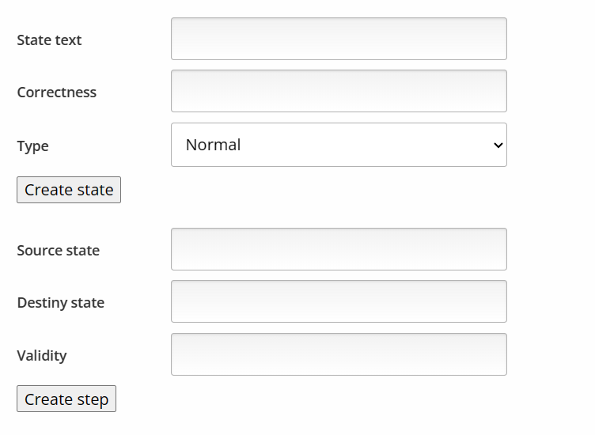
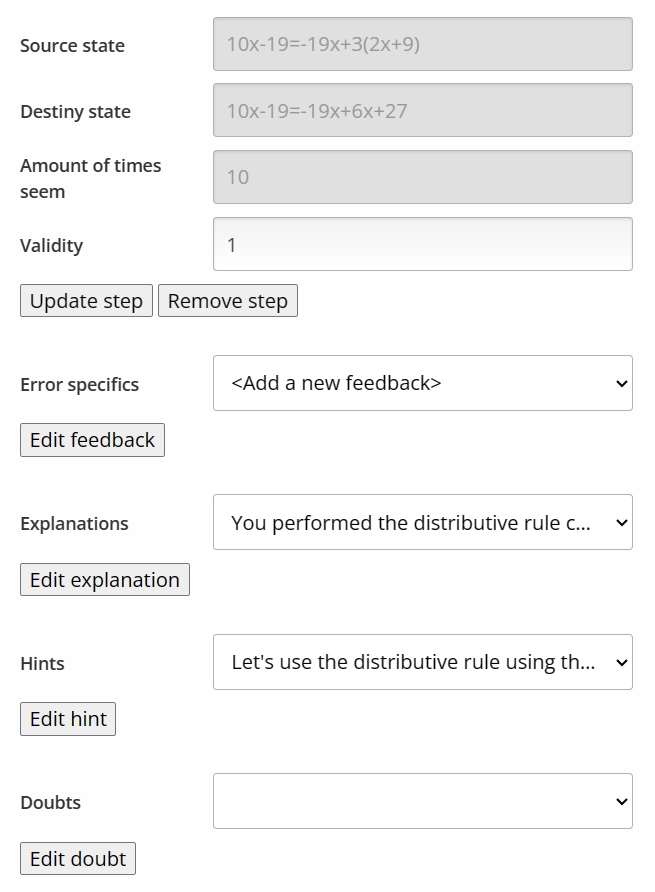

The graph editor is the main feature for the QUATIS, since it's a simplification of the knowledge for each exercised.

# Graph visualization

On the left, you will be able to see the graph itself and interact with it. You can click with the mouse to select the graph nodes or edges and change their position. You can also click and hold on a empty space to span the view.

If you prefer, you can click on the **+** and **-** buttons on the top left corner to increass or decrease the zoom level of the graph.

Ypu can right-click on the graph to show additional options, like enter in fullscreen view or save the graph as a .png or .svg file for later use

The graph rendering uses the AnyChart. While Anychart is a paid software, we were given for free since it's for educational purposes.
You can check about then [here](https://www.anychart.com/).

# Menus

## Add element menu

On the right sice of the interface, you can use it to add, edit or remove the elements on the graph. 

Initially, it will setup as a add element. You can add both nodes and edges from here:

## Edit node menu

If you click on any node or edge in the left side of the screen, the windows on the right will change, showing the information of the selected element. If it's a node it will look like this:

Here, you will be able to change the following details of the node
- Correctness: It says how correct or wrong a node is. The value varies from -1 (incorrect) to 1 (correct)
- Final answer: if the node is used as a final step non a correct solution, put here the exact alternative
- Type: a node can be initial, normal or final. Initial means it can be used as the initial step of a solution. Final means it can be used as the final step
- Doubts: one of the feedbacks, it will be explained with more details later

A node is correct when it's used in at least one correct solution.
If we use the equation **X - 20 - 7 = 30** as an example:

Above, all nodes would be correct (correctness = 1), since it's a correct solution.
Now, if we check the following example:

Since the node **X = 30 - 27** is wrong ando also turns the solution to a wrong one, then it's considered as an incorrect (correctness = -1). 
Since **X = 3** is also a wrong answer (so it will be used in a incorrect solution), it's also considered as incorrect.

## Edge menu

If it's an edge it will look like this:

- Validity: It says how correct or wrongt a node is. The value varies from -1 (incorrect) to 1 (correct)

An edge is considered as valid if the action from the source node to the destiny node is correct. if we use the example below:

Since the action from **X - 20 - 7 = 30** to the **X - 20 = 30 + 7** is mathmatically valid, then the edge is valid (validty = 1)

If we see another example:

Since the action is not mathematically correct, then the edge is also cinsidered as invalid (validity = -1)

## Feedbacks

ITSs will show feedbacks to students in order to help then during the exercise. These feedbacks are all text messages that will be choosen by analyzing the current solution.

There are 5 types of feedbacks that QUATIS may show:
- Hints: used to help when a student is stuck on a step and doe not know how to proceed
- Explanations: used when the student made a correct action from one step to another. It will explain why the action is correct, since there's a possibility that the student made it by luck 
- Error Specific: used when the soltuion contains an action that wen't from a correct step to an incorrect one. It will explain why the action is incorrect
- Doubts: created only by the students, it's used to send a question that other students or the teacher can answer
- Answers: used as a response to questions

Hints and explanations are added in valid edges, while the error specific ones are added on invalid edges, where the source node is correct and the destiny node is incorrect. Finally, the doubts and answers can be added in both nodes and edges, regardless of their correctness or validity.

If you try editing any feedback, like hints or explanations, it will look like this>

These are the elements you can edit from an existing feedback:
- Text: What will be shown to students
- Order: In cases where the same step has multiple feedbacks, they will follow the order. The order that feedbacks will be shown to the student is in a crescent order (1 comes first than 2)
- Usefulness: shows how much students liked this feedback or not. Each positive vote increases the value by 1, while each negative vote decreases by 1